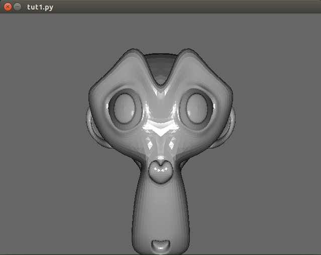

[](https://travis-ci.org/ratcave/ratcave)

[](https://ci.appveyor.com/project/neuroneuro15/ratcave)

[](https://coveralls.io/github/ratcave/ratcave?branch=master)


# ratcave
3D Graphics Engine running off Python, Psychopy, and Pyglet using modern OpenGL conventions.

Full Documentation and Tutorials can be found at http://ratcave.readthedocs.io/


## Installation
```
pip install pyglet numpy ratcave
```

## Features

ratcave was created to be an 3D graphics package for doing behavioral experiments with animals in a freely-moving virtual reality environment, and
somewhere along the way became a pythonic wrapper for modern OpenGL workflows!

The goals of this project are:

  - *Less Boilerplate, more Coding*: More code means more errors.  Many behavioral experiments tend to be complex sets of logic written in a single script, so I tried to make ratcave as low-profile as possible to keep the focus on the experiment, not on the graphics management.
  - *Ease of Use*: Moving objects in a scene, displaying a window, and changing objects' colors should be intuitive.
  - *high-temporal performance*: Lag is the enemy of immersive VR, and we wanted to take advantage of our 360 fps display for VR research.  Advanced hardware-accelerated algorithms and modern OpenGL constructs are an essential part of doing high-performance graphics in Python.
  - *Cubemapping Support* (the essential algorithmic approach for a single-projector CAVE VR system),
  - *Cross-Platform*: Windows and Linux are both actively supported (Max OS X not tested, but should also be good!)
  - *Python 2 and 3 Support*: No worries, no hassle.
  - *Free and Open Source*


What I've found so far is that ratcave makes for a succinct 3D graphics engine, even for simple 3D scenes, making it a useful candidate package for psychophysics research in general.
To that end, I've made it very compatible with the PsychoPy package, as a way of extending PsychoPy experiments to 3D scenes.
While we are still at an early stage of development with ratcave, we've already reached the requirements listed above, with a goal of continually refactoring and adding features to make ratcave the mature utility it has the potential to be.  If you are interested in aiding the development of ratcave, either through contributions on GitHub, bug reporting, or even simply testing it out yourself and giving us feedback, we hope you'll get involved and help us develop this little project into something wonderful!

## Examples

Reading a mesh from a Wavefront File and drawing it with a built-in shader:

```python
import pyglet
import ratcave as rc

window = pyglet.window.Window()
pyglet.clock.schedule(lambda dt: dt)

monkey = rc.WavefrontReader(obj_filename).get_mesh("Monkey")
monkey.position.xyz = 0, 0, -2

@window.event
def on_draw():
  with rc.default_shader, rc.default_states:
      monkey.draw()

pyglet.app.run()
```



More examples can be found in the examples directory, and tutorials can be found in the documentation!
