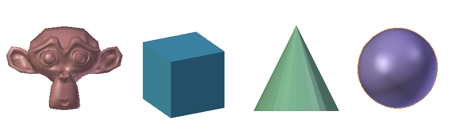
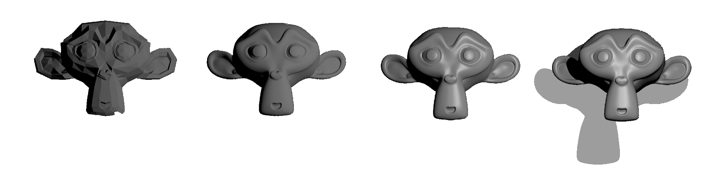

Introduction
============

ratCAVE is a Python package for displaying 3D Graphics.
It was inspired by a Virtual Reality CAVE Setup for rodents in a neuroscience lab in Munich, Germany, and was meant
to make the creation of 3D experiments simple and accessible.

ratCAVE has since evolved into a standalone wrapper for modern OpenGL constructs, like programmable shaders,
environment mapping, and deferred rendering.  Because it wraps these OpenGL features directly, it also works with all
popular python OpenGL graphics engines, including Pyglet, PsychoPy, and PyGame.

Finally, ratCAVE is written to reduce boilerplate code, in order to make writing simple 3D environments easy.  It does this using
many python features, including dictionary-like uniform assignment and context managers to bind OpenGL objects.

Installation
============
ratCAVE supports both Python 2 and Python 3, and can be installed via pip!::

   pip install ratcave

Features
========

ratCAVE was created to be an grapics package for doing behavioral experiments with animals in a freely-moving virtual reality environment.
The goals of this project are:

  - *Less Boilerplate, more Coding*: More code means more errors.  Many behavioral experiments tend to be complex sets of logic written in a single script, so I tried to make ratCAVE as low-profile as possible to keep the focus on the experiment, not on the graphics management.
  - *Ease of Use*: Moving objects in a scene, displaying a window, and changing objects' colors should be intuitive.
  - *high-temporal performance*: Lag is the enemy of immersive VR, and we wanted to take advantage of our 360 fps display for VR research.  Advanced hardware-accelerated algorithms and modern OpenGL constructs are an essential part of doing high-performance graphics in Python.
  - *Cubemapping Support* (the essential algorithmic approach for a single-projector CAVE VR system),
  - *Free and Open Source*

What I've found so far is that ratCAVE makes for a succinct 3D graphics engine, even for simple 3D scenes, making it a useful candidate package for psychophysics research in general.
To that end, I've made it very compatible with the PsychoPy package, as a way of extending PsychoPy experiments to 3D scenes.
While we are still at an early stage of development with ratCAVE, we've already reached the requirements listed above, with a goal of continually refactoring and adding features to make ratCAVE the mature backend it has the potential to be.  If you are interested in aiding the development of ratCAVE, either through contributions on GitHub, bug reporting, or even simply testing it out yourself and giving us feedback, we hope you'll get involved and help us develop this little project into something wonderful!

Supplied 3D Primitives
++++++++++++++++++++++

`Blender 3D's <https://www.blender.org/>`_ built-in primitives (Cone, Sphere, Cube, etc) come packaged with ratCAVE, making it easier to get started and prototype your 3D application.
A reader object for Blender's .obj Wavefront files is also included.

Supplied 3D Shaders
+++++++++++++++++++

ratCAVE is "batteries-included": You get diffuse shading, specular reflections, shadows, and even FXAA antialiasing in the
packaged shaders. These shaders are open-source and free to be edited and improved!

Pythonic Interface
++++++++++++++++++

FrameBuffer Context Managers
~~~~~~~~~~~~~~~~~~~~~~~~~~~~

Normally, the OpenGL code to bind a framebuffer involves the following::

    glGetIntegerv(GL_VIEWPORT, old_viewport_size)
    glBindFramebufferEXT(GL_FRAMEBUFFER_EXT, fbo_id)  # Rendering off-screen
    glViewport(0, 0, texture_width, texture_height)
    << Draw Scene Here >>
    glBindFramebufferEXT(GL_FRAMEBUFFER_EXT, 0)
    glViewport(old_viewport_size)

In ratCAVE, this is a simple context manager::

    with fbo:
       scene.draw()

Shader Uniforms
~~~~~~~~~~~~~~~

OpenGL Shader Uniform creation and setting is also wrapped in a pythonic way::

    sphere.uniforms['diffuse_color'] = [1., 0., 0.]  # RGB values

Fast Execution
++++++++++++++

ratCAVE uses Numpy arrays, c binaries, and GLSL OpenGL to make rendering detailed scenes fast!

System Requirements
===================
At the moment, ratCAVE's shaders require OpenGL 3.3, though this is planned to change in future releases.  If you'd like to use
ratCAVE and don't have a graphics driver that supports OpenGL 3.3, however, you can already load your own shaders and it will
work fine.
