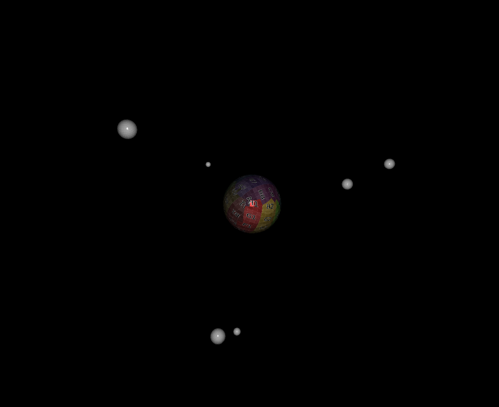

Tutorial 5: Parenting objects together - Solar System
+++++++++++++++++++++++++++++++++++++++++++++++++++++

This tutorial is based on previous.

In this tutorial you will learn how to use ratcave to create solar system animation.
We will show how to create layout dependencies (in between parent and children objects), by defining relationships between objects.
Additionally the :py:class:`.Empty Entity` objects will be introduced.

.. warning:: This tutorial builds on the previous tutorials. If you're just getting started, it's recommended to go back and do those tutorials first!

Initial Script
--------------

Since the previous tutorials have already covered a lot of ratcave methods, let's just start with the following script::

    import pyglet
    import ratcave as rc

    # Create Window
    window = pyglet.window.Window(resizable=True)

    def update(dt):
        pass
    pyglet.clock.schedule(update)

    # Insert filename into WavefrontReader.
    obj_filename = rc.resources.obj_primitives
    obj_reader = rc.WavefrontReader(obj_filename)

Meshes and Empty Entities
-------------------------

We can not define more then one rotation speed for the sun object. To introduce different rotation for each of the planets, we need to use Empty Entities.
Empty Entities are objects, that occupie physical space, but doesn't actually draw anything when :py:func:`Scene.draw()` is called (just passing the values).
Later, we can set rotation speed for each of the :py:class:`.Empty Entity` object::

    # Create Meshes
    sun = obj_reader.get_mesh("Sphere", name='sun')
    merkury = obj_reader.get_mesh("Sphere", scale =.1, name='merkury')
    venus   = obj_reader.get_mesh("Sphere", scale =.2, name='venus')
    earth   = obj_reader.get_mesh("Sphere", scale =.2, name='earth')
    mars    = obj_reader.get_mesh("Sphere", scale =.2, name='mars')
    jupyter = obj_reader.get_mesh("Sphere", scale =.4, name='jupyter')
    moon = obj_reader.get_mesh("Sphere", scale =.5, name='moon')

    # Create Empty Entities
    empty_merkury = rc.EmptyEntity(name='sun_merkury')
    empty_venus   = rc.EmptyEntity(name='sun_venus')
    empty_earth   = rc.EmptyEntity(name='sun_earth')
    empty_mars    = rc.EmptyEntity(name='sun_mars')
    empty_jupyter = rc.EmptyEntity(name='sun_jupyter')

Define Relationships and Relative Positions
-------------------------------------------

Relationships Between Objects
=============================

To define layout relationship in between objects in ratcave, user has to link them togheter using :py:class:`.SceneGraph` properties:
 - :py:func:`Mesh.add_child()`
 - :py:func:`Mesh.add_children()`
 - :py:func:`Mesh.parent()`

The following code does the job::

    # Define Relationships
    sun.add_children(empty_merkury, empty_earth, empty_venus, empty_mars, empty_jupyter)

    empty_merkury.add_child(merkury)
    empty_venus.add_child(venus)
    empty_earth.add_child(earth)
    empty_mars.add_child(mars)
    empty_jupyter.add_child(jupyter)

    earth.add_child(moon)

Relative Objects Positions
==========================

Additionally it is important to define the position of the children in relative position to the parent (position of planets in relation to the sun).
This can be done in a following way::

    # Define Relative Positions
    sun.rotation.x = 50
    sun.position.xyz = 0, 0, -12

    merkury.position.z += 1
    venus.position.z += 2
    earth.position.z += 3
    mars.position.z += 4
    jupyter.position.z += 5

    moon.position.z += 1

Setting Rotations
-----------------

Each of the roations has to be set separately::

    def on_draw():
        with rc.default_shader:
        sun.rotation.y += 0.5
        earth.rotation.y += 0.5
        empty_merkury.rotation.y += 2
        empty_venus.rotation.y += 1.5
        empty_earth.rotation.y += 1
        empty_mars.rotation.y += 0.75
        empty_jupyter.rotation.y += 0.5

Scene - Update
------

After defintion of a scene::

    scene = rc.Scene(meshes=sun, bgColor=(0,0,0))

sun and all of its children now get drawn when :py:func:`scene.draw()` gets called. There is no further need of updating any of the Meshes (or its children) included in the scene.
You can also decide which of the elements are going to be drawn, by calling them separately, the position of the planets will still be relative to the sun (also when sun itself is not being drawn)::

    def on_draw():
        window.clear()
        with rc.default_shader, scene.camera, scene.light:
            sun.draw()
            earth.draw()

Additionally you can parent the camera and light to one of the Mesh objects. It can be done in following manner::

    #Define Relationships For Cameras and Objects
    earth.add_child(scene.camera)
    earth.add_child(scene.light)

If you run it, you should see this simulation of solar system:

Summary
-------

Here is the full code for the Tutorial 5::

    import pyglet
    from pyglet.window import key
    import ratcave as rc

    # Create Window
    window = pyglet.window.Window(resizable=True)
    keys = key.KeyStateHandler()
    window.push_handlers(keys)

    def update(dt):
        pass
    pyglet.clock.schedule(update)

    # Insert filename into WavefrontReader.
    obj_filename = rc.resources.obj_primitives
    obj_reader = rc.WavefrontReader(obj_filename)

    # Create Meshes
    sun = obj_reader.get_mesh("Sphere", name='sun')
    merkury = obj_reader.get_mesh("Sphere", scale =.1, name='merkury')
    venus   = obj_reader.get_mesh("Sphere", scale =.2, name='venus')
    earth   = obj_reader.get_mesh("Sphere", scale =.2, name='earth')
    mars    = obj_reader.get_mesh("Sphere", scale =.2, name='mars')
    jupyter = obj_reader.get_mesh("Sphere", scale =.4, name='jupyter')
    moon = obj_reader.get_mesh("Sphere", scale =.5, name='moon')

    # Create Empty Entities
    empty_merkury = rc.EmptyEntity(name='sun_merkury')
    empty_venus   = rc.EmptyEntity(name='sun_venus')
    empty_earth   = rc.EmptyEntity(name='sun_earth')
    empty_mars    = rc.EmptyEntity(name='sun_mars')
    empty_jupyter = rc.EmptyEntity(name='sun_jupyter')

    # Define Relationships
    sun.add_children(empty_merkury, empty_earth, empty_venus, empty_mars, empty_jupyter)

    empty_merkury.add_child(merkury)
    empty_venus.add_child(venus)
    empty_earth.add_child(earth)
    empty_mars.add_child(mars)
    empty_jupyter.add_child(jupyter)

    earth.add_child(moon)

    # Define Relative Positions
    sun.rotation.x = 50
    sun.position.xyz = 0, 0, -12

    merkury.position.z += 1
    venus.position.z += 2
    earth.position.z += 3
    mars.position.z += 4
    jupyter.position.z += 5

    moon.position.z += 1

    sun.textures.append(rc.Texture.from_image(rc.resources.img_colorgrid))

    # Create Scene
    scene = rc.Scene(meshes=sun, bgColor=(0,0,0))
    scene.camera.projection.z_far = 20

    # Define Relationships For Cameras and Objects
    # earth.add_child(scene.camera)
    # earth.add_child(scene.light)

    planets = [sun, earth, jupyter]

    def move_camera(dt):
        '''function used to parent the camera to a different planet'''
        if keys[key.LEFT]:
            cam_parent = planets.pop(0)
            cam_parent.add_child(scene.camera)
            planets.append(cam_parent)

    pyglet.clock.schedule(move_camera)

    @window.event
    def on_draw():
        window.clear()
        sun.rotation.y += 0.5
        earth.rotation.y += 0.5
        empty_merkury.rotation.y += 2
        empty_venus.rotation.y += 1.5
        empty_earth.rotation.y += 1
        empty_mars.rotation.y += 0.75
        empty_jupyter.rotation.y += 0.5

        with rc.default_shader:
            scene.draw()

    pyglet.app.run()
