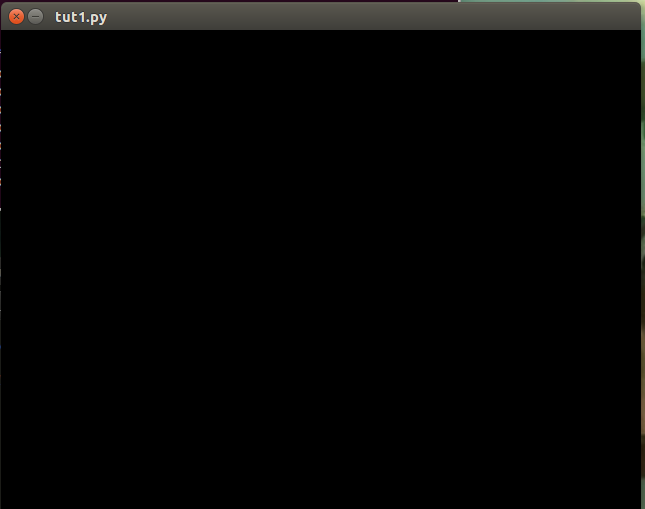

Tutorial 1: Displaying a 3D Object
++++++++++++++++++++++++++++++++++

This tutorial will show the process of displaying a 3D object onscreen. This will be done in four steps:
  - We'll open a file containing 3D objects--a Wavefront .obj file containing basic 3D primitives that comes with ratcave (although you can use any .obj file outputted by 3D modeling software), using the :py:class:`.WavefrontReader` class.
  - We then retrieve a :py:class:`.Mesh` object from the file. Mesh objects contain all information about the object, including its position (inside its Local and World attributes, which are :py:class:`.Physical` objects), color (inside its Material attribute, which are of the :py:class:`.Material` class), and even the vertex data itself.
  - We'll put the Mesh inside a :py:class:`.Scene` object, which is a container class that holds :py:class:`.Mesh` objects, a :py:class:`.Camera` object, and a :py:class:`.Light` object, along with an RGB background color. Multiple Scenes can be created, even ones that contain the same Meshes, and rendering one vs another one is as simple as calling the scene's :py:class:`Scene.draw()` method.

.. note:: Each tutorial follows from each other, assuming knowledge of the previous.  To get the most out of ratcave, then, it is best to do them in order!

.. note:: Some of the constructs in this tutorial, like decorators and event loops, come from Pyglet.  While completely understanding them isn't necessary, it'll probably best to start out with a Pyglet tutorial to get your feet wet.  This one is good: http://www.natan.termitnjak.net/tutorials/pyglet_basic.html

Starting an OpenGL Context and a Window
---------------------------------------

ratcave depends on their already being an OpenGL context set up before loading objects.  This can be done by any OpenGL manager (Pyglet and PsychoPy are useful, but PyGame and Qt OpenGL windows should work fine as well).
So, before doing anything in ratcave, a window must first be created.  In these tutorials, I'll show it with Pyglet::

  import pyglet
  import ratcave as rc

  window = pyglet.window.Window()

If you want to verify that Pyglet is working and the window gets created, just start Pyglet's event loop at the end of your script. This script will create a Pyglet window that closes when you press
the escape key::

  pyglet.app.run()

.. warning:: Creating a Window automatically starts the OpenGL context, which is important for many aspects of ratcave.  As a general rule, it's good to make your window first, before doing anything else!

Getting Pyglet Actively Drawing
-------------------------------

Pyglet's event loop won't automatically update the scene, so we'll stick in a function that does nothing, that gets called every frame, to guarantee that everything appears onscreen.  Anything you want done between frames (updating positions, logging events, etc) can go in this function.::

  def update(dt):
      pass
  pyglet.clock.schedule(update)

Reading a Wavefront .obj file
-----------------------------

To load a 3D object, let's read in a .obj file! The built-in :py:class:`WavefrontReader` can read triangulated, uv-maped .obj files exported from Blender.  ratcave comes with some primitive 3D objects in its :py:class:`resoufruites` module, so let's use one of those.::

  # Insert filename into WavefrontReader.
  obj_filename = rc.resources.obj_primitives
  obj_reader = rc.WavefrontReader(obj_filename)

  # Check which meshes can be found inside the Wavefront file, and extract it into a Mesh object for rendering.
  print(obj_reader.bodies.keys())
  >>> ['Torus', 'Sphere', 'Monkey', 'Cube']

Loading a Mesh from the WavefrontReader and Positioning it
----------------------------------------------------------

Loading a mesh can be done through the :py:meth:`.WavefrontReader.get_mesh` method.  By default, the mesh will have its position in the same location as in its .obj file, but this can be easily changed.  Because the camera is in the -z direction by default per OpenGL convention, let's set it in front of the camera::

  monkey = obj_reader.get_mesh("Monkey")
  monkey.position.xyz = 0, 0, -2

Creating a Scene
----------------

Scenes consist of meshes, lights, and a camera--everything we need to view and position and object in the real world! Let's put the monkey :py:class:`.Mesh` into a :py:class:`.Scene`::

  scene = rc.Scene(meshes=[monkey])

Drawing the Scene
-----------------

To draw the scene, we need a 3D shader (discussed in more detail in the next tutorial).  Luckily, ratcave provides one to start with!  Simply call the Scene.draw() method in your draw loop! In Pyglet, this looks like this::

    @window.event
    def on_draw():
        with rc.default_shader:
            scene.draw()

  pyglet.app.run()

Summary
-------

That's it!  Here's the final script, in one place.  This script wll be modified in the next tutorial to animate the scene.::

  import pyglet
  import ratcave as rc

  # Create Window
  window = pyglet.window.Window()

  def update(dt):
      pass
  pyglet.clock.schedule(update)

  # Insert filename into WavefrontReader.
  obj_filename = rc.resources.obj_primitives
  obj_reader = rc.WavefrontReader(obj_filename)

  # Create Mesh
  monkey = obj_reader.get_mesh("Monkey")
  monkey.position.xyz = 0, 0, -2

  # Create Scene
  scene = rc.Scene(meshes=[monkey])

  @window.event
  def on_draw():
      with rc.default_shader:
          scene.draw()

  pyglet.app.run()

Version using PsychoPy
----------------------

Alternatively, you can see the same example using a PsychoPy window::

  import ratcave as rc
  from psychopy import visual, event

  # Create Window
  window = visual.Window()

  # Insert filename into WavefrontReader.
  obj_filename = rc.resources.obj_primitives
  obj_reader = rc.WavefrontReader(obj_filename)

  # Create Mesh
  monkey = obj_reader.get_mesh("Monkey")
  monkey.position.xyz = 0, 0, -2

  # Create Scene
  scene = rc.Scene(meshes=[monkey])

  while 'escape' not in event.getKeys():
      with rc.default_shader:
          scene.draw()
      window.flip()

  window.close()

.. image:: _static/tut1_gray_monkey.png
