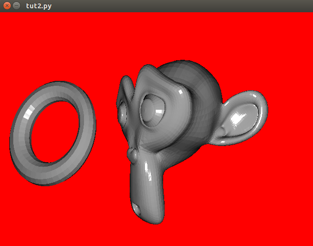

Tutorial 2: Animating a Scene with Multiple Meshes and Moving the Camera with the  Keyboard
+++++++++++++++++++++++++++++++++++++++++++++++++++++++++++++++++++++++++++++++++++++++++++

This tutorial will build on the previous one by adding some more interesting elements.  We'll allow the user to move the scene's camera by pressing the left and right arrow keys, and have multiple meshes in the scene that move.

.. warning:: This tutorial builds on code from Tutorial 1.  If you have not yet completed Tutorial 1, it's best to go and do that, first!

Scenes Hold Lists of Meshes
---------------------------

Let's insert a couple Meshes from our obj_reader WavefrontReader object into the scene!::

  # Create Meshes from WavefrontReader
  monkey = obj_reader.get_mesh("Monkey", position=(0, 0, -1.5), scale=.6)
  torus = obj_reader.get_mesh("Torus", position=(-1, 0, -1.5), scale=.4)

  # Create Scenes with Meshes.
  scene = rc.Scene([monkey, torus])

Moving a Mesh
-------------

Now, we'll animate the Meshes by changing their rotation attributes in the update function::

  def rotate_meshes(dt):
      monkey.rot_y += 15 * dt  # dt is the time between frames
      torus.rot_x += 80 * dt
  pyglet.clock.schedule(rotate_meshes)

 
Modifying Scene's Background Color
----------------------------------

Scenes also have a background color, saved as an RGB tuple in the Scene.bgColor attribute::

  scene.bgColor = 1, 0, 0

Moving the Camera with the Keyboard
-----------------------------------

While we could easily make a new :py:class:`.Camera` object from scratch, we'll just grab the scene's camera and have it accept keyboard inputs for movement::

  # This is how to get keyboard input in pyglet:
  from pyglet.window import key
  keys = key.KeyStateHandler()
  window.push_handlers(keys)

  def move_camera(dt):
    camera_speed = 3
    if keys[key.LEFT]:
        scene.camera.x -= camera_speed * dt
    if keys[key.RIGHT]:
        scene.camera.x += camera_speed * dt
  pyglet.clock.schedule(move_camera)

Now you should have an interactive scene!  Don't forget to use the arrow keys to move around!

Summary
-------

Here's the full code for Tutorial 2::

  import pyglet
  from pyglet.window import key
  import ratcave as rc

  # Create Window and Add Keyboard State Handler to it's Event Loop
  window = pyglet.window.Window()
  keys = key.KeyStateHandler()
  window.push_handlers(keys)

  # Insert filename into WavefrontReader.
  obj_filename = rc.resources.obj_primitives
  obj_reader = rc.WavefrontReader(obj_filename)

  # Create Mesh
  monkey = obj_reader.get_mesh("Monkey", position=(0, 0, -1.5), scale=.6)
  torus = obj_reader.get_mesh("Torus", position=(-1, 0, -1.5), scale=.4)

  # Create Scene
  scene = rc.Scene(meshes=[monkey, torus])
  scene.bgColor = 1, 0, 0

  # Functions to Run in Event Loop
  def rotate_meshes(dt):
      monkey.rot_y += 15 * dt  # dt is the time between frames
      torus.rot_x += 80 * dt
  pyglet.clock.schedule(rotate_meshes)

  def move_camera(dt):
      camera_speed = 3
      if keys[key.LEFT]:
          scene.camera.x -= camera_speed * dt
      if keys[key.RIGHT]:
          scene.camera.x += camera_speed * dt
  pyglet.clock.schedule(move_camera)

  @window.event
  def on_draw():
    scene.draw()

  pyglet.app.run()

PsychoPy Version
----------------

Here's the same scenario, done in PsychoPy::

    from psychopy import visual, event
    import ratcave as rc

    camera_speed = 2

    # Create Window and Add Keyboard State Handler to it's Event Loop
    window = visual.Window()

    # Insert filename into WavefrontReader.
    obj_filename = rc.resources.obj_primitives
    obj_reader = rc.WavefrontReader(obj_filename)

    # Create Mesh
    monkey = obj_reader.get_mesh("Monkey", position=(0, 0, -1.5), scale=.6)
    torus = obj_reader.get_mesh("Torus", position=(-1, 0, -1.5), scale=.4)

    # Create Scene
    scene = rc.Scene(meshes=[monkey, torus])
    scene.bgColor = 1, 0, 0

    while True:

        dt = .016

        keys_pressed = event.getKeys()
        if 'escape' in keys_pressed:
            window.close()
            break

        # Move Camera
        for key in keys_pressed:
            if key == 'left':
                scene.camera.x -= camera_speed * dt
            elif key == 'right':
                scene.camera.x += camera_speed * dt

        # Rotate Meshes
        monkey.rot_y += 15 * dt  # dt is the time between frames
        torus.rot_x += 80 * dt

        # Draw Scene and Flip to Window
        scene.draw()
        window.flip()
