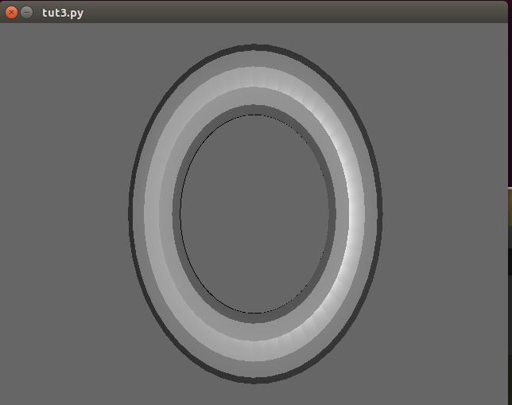
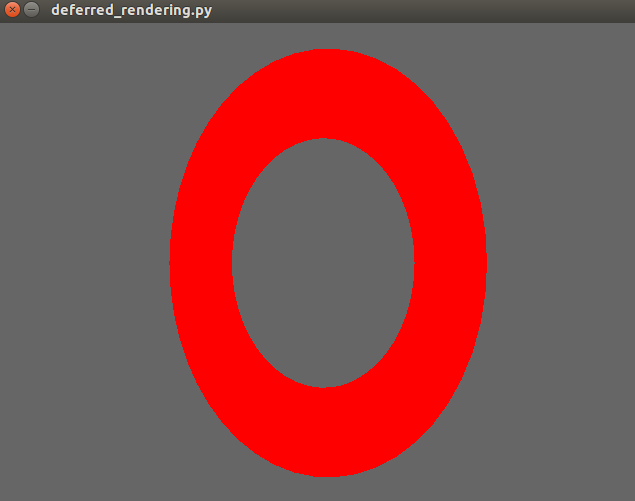
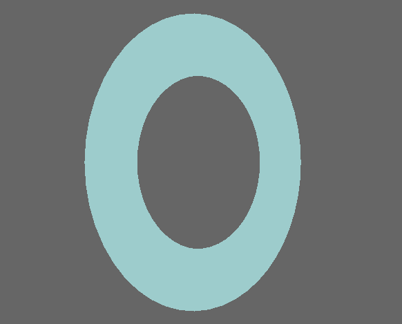

Tutorial 3: Custom GLSL Shaders, Sending Data to the Graphics Card
==================================================================

.. todo:: Write this tutorial!

To get the most out of our graphics, many newer graphics engines use programs running on the graphics card called
"shaders" to specify how objects should be shown on-screen.  While teaching GLSL shaders is beyond the scope of this tutorial,
and ratcave allows you to completely skip writing shaders at all by supplying a few useful ones, you'll likely want to
use a shader of your own.

In this tutorial, you'll learn how to use ratcave to:

  - Compile a :py:class:`.Shader` object and use it in the :py:func:`.Scene.draw()` function.
  - Send data to the shader from Python as a :py:class:`.Uniform` variable.

.. warning:: This tutorial builds on the previous tutorials.  If you're just getting started, it's recommended to go back and do those tutorials first!

Initial Script
--------------

Since the previous tutorials have already covered a lot of ratcave methods, let's just start with the following script::

    import pyglet
    import ratcave as rc

    # Create window and OpenGL context (always must come first!)
    window = pyglet.window.Window()

    # Load Meshes and put into a Scene
    obj_reader = rc.WavefrontReader(rc.resources.obj_primitives)
    torus = obj_reader.get_mesh('Torus', position=(0, 0, -2))

    scene = rc.Scene(meshes=[torus])

    # Constantly-Running mesh rotation, for fun
    def update(dt):
        torus.rotation.y += 20. * dt
    pyglet.clock.schedule(update)

    # Draw Function
    @window.event
    def on_draw():
        with rc.default_shader:
            scene.draw()

    # Pyglet's event loop run function
    pyglet.app.run()

This code should display a rotating torus on the window.

Creating a Custom GLSL Shader
-----------------------------

Now, one thing ratcave does automatically is use it's built-in **genShader** :py:class:`.Shader`, if none is specified.  This is
to make it easier to get started.  Let's replace it with our own custom shader program, which simply positions the mesh in 3D space.

Shader programs come in two types.  **Vertex Shaders** tell the graphics card where a vertex will appear on your screen.
Our shader here will take data from the meshes, the lights, and the camera to determine where everything goes::

    vert_shader = """
    #version 330

    layout(location = 0) in vec3 vertexPosition;
    uniform mat4 projection_matrix, view_matrix, model_matrix;
    out vec4 vVertex;

    void main()
    {
        vVertex = model_matrix * vec4(vertexPosition, 1.0);
        gl_Position = projection_matrix * view_matrix * vVertex;
    }
    """

.. warning:: This shader requires OpenGL 3.3 drivers to be installed, along with an OpenGL 3.3-compatible graphics card on your system.

The **fragment shader** takes the vertex shader's position data determines what color a pixel on the screen will be.
These can get quite complex, but we'll use a fairly simple one here, and just make everything automatically appear red::

    frag_shader = """
    #version 330
    out vec4 final_color;
    void main()
    {
        final_color = vec4(1., 0., 0., 1.);
    }
    """

.. note:: Normally, you would just put these shaders in their own files, but here we'll keep everything together and use them as strings.

Now, to make the :py:class:`.Shader` ::

    shader = rc.Shader(vert=vert_shader, frag=frag_shader)

Using the shader during drawing is done in a shader keyword argument in :py:func:`.Scene.draw()`::

    scene.draw(shader=shader)

Here is what the code should look like now::

    import pyglet
    import ratcave as rc

    vert_shader = """
    #version 330

    layout(location = 0) in vec3 vertexPosition;
    uniform mat4 projection_matrix, view_matrix, model_matrix;
    out vec4 vVertex;

    void main()
    {
        vVertex = model_matrix * vec4(vertexPosition, 1.0);
        gl_Position = projection_matrix * view_matrix * vVertex;
    }
    """

    frag_shader = """
    #version 330
    out vec4 final_color;
    void main()
    {
        final_color = vec4(1., 0., 0., 1.);
    }
    """

    shader = rc.Shader(vert=vert_shader, frag=frag_shader)

    # Create window and OpenGL context (always must come first!)
    window = pyglet.window.Window()

    # Load Meshes and put into a Scene
    obj_reader = rc.WavefrontReader(rc.resources.obj_primitives)
    torus = obj_reader.get_mesh('Torus', position=(0, 0, -2))

    scene = rc.Scene(meshes=[torus])

    # Constantly-Running mesh rotation, for fun
    def update(dt):
        torus.rot_y += 20. * dt
    pyglet.clock.schedule(update)

    # Draw Function
    @window.event
    def on_draw():
        with shader:
            scene.draw()

    # Pyglet's event loop run function
    pyglet.app.run()

If you run it, you should see a flat red torus!

Sending Data to the Shader using Uniforms
-----------------------------------------

Data can be attached to each object and sent to the shaders, to customize their behavior.  Here, let's let the
:py:func:`Mesh.uniforms['diffuse']` uniform control what color the torus takes.

In the fragment shader, add this line to initialize the **diffuse** uniform variable before the main function::

    uniform vec3 diffuse;

In the python code, modify the diffuse key in the :py:func:`Mesh.uniforms` attribute::

    torus.uniforms['diffuse'] = [.2, .8, .8]

.. note:: All ratcave objects come with some default uniforms, to make setting up easier and to make naming schemas more consistent.  This shouldn't restrict you, though--new uniforms are automatically initialized when you add them dictionary-style, like **torus.uniforms['my_uniform'] = 3.0**!

If you run the code now, you should now see a cyan rotating torus.  Let's make it a little more dynamic, shall we? ::

    import time
    import math
    def update_color(dt):
        torus.uniforms['diffuse'][0] = 0.5 * math.sin(time.clock()) + 1
    pyglet.clock.schedule(update_color)

Now the torus will change color!

Summary
-------

Here's the updated code::

    import pyglet
    import ratcave as rc
    import time
    import math

    vert_shader = """
     #version 330

     layout(location = 0) in vec3 vertexPosition;
     uniform mat4 projection_matrix, view_matrix, model_matrix;
     out vec4 vVertex;

     void main()
     {
         vVertex = model_matrix * vec4(vertexPosition, 1.0);
         gl_Position = projection_matrix * view_matrix * vVertex;
     }
     """

    frag_shader = """
     #version 330
     out vec4 final_color;
     uniform vec3 diffuse;
     void main()
     {
         final_color = vec4(diffuse, 1.);
     }
     """

    shader = rc.Shader(vert=vert_shader, frag=frag_shader)

    # Create window and OpenGL context (always must come first!)
    window = pyglet.window.Window()

    # Load Meshes and put into a Scene
    obj_reader = rc.WavefrontReader(rc.resources.obj_primitives)
    torus = obj_reader.get_mesh('Torus', position=(0, 0, -2))
    torus.uniforms['diffuse'] = [.5, .0, .8]

    scene = rc.Scene(meshes=[torus])

    # Constantly-Running mesh rotation, for fun
    def update(dt):
        torus.rotation.y += 20. * dt
    pyglet.clock.schedule(update)

    def update_color(dt):
        torus.uniforms['diffuse'][0] = 0.5 * math.sin(time.clock() * 10) + .5
    pyglet.clock.schedule(update_color)

    # Draw Function
    @window.event
    def on_draw():
        with shader:
            scene.draw()

    # Pyglet's event loop run function
    pyglet.app.run()

In the next tutorial, we'll follow this up by drawing to an :py:class:`.FBO` dynamically!