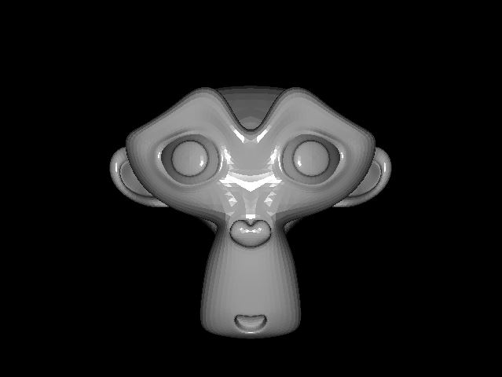

Tutorial 6: Stereopsis (3D)
++++++++++++++++++++++++++++++++++++++++++++++++++++++++

Up until now, we were creating a scene that containts 3D objects, and we were looking at the scene through our screen(s). This means the 3D scene is projected onto a 2D screen. We still observe depth due to motion parallax, lighting, and other so-called monocular cues, but we do not have a 3D view which gives us a better sense of objects' depth.

Stereopsis is the perception of depth obtained through binocular disparity, which requires the graphics package to provide separate images for each eye. Luckily, ratcave does that!

Let's get the monkey on our screen.

Initial Script
------------------------------------------------------------------

Here is a script which displays the monkey on your screen::

	import pyglet
	import ratcave as rc

	window = pyglet.window.Window(resizable=True)

	model_file = rc.resources.obj_primitives
	monkey = rc.WavefrontReader(model_file).get_mesh('Monkey')
	monkey.position.xyz = 0, 0, -2.5

	camera = rc.Camera()

	@window.event
	def on_draw():
	    window.clear()
	    with rc.default_shader, rc.default_states, camera:
	        monkey.draw()

	def update(dt):
	    pass
	pyglet.clock.schedule(update)

	pyglet.app.run()

When the light is reflected from the monkey's face we get a feeling that the monkey is a 3D object. But are we seeing 3D? No.

StereoCameraGroup
------------------

Earlier we talked about stereopsis - having two different images for each eye to perceive depth. Tehrefore, the first step is to actually have two eyes. The "eye" in our virtual scene is the camera. We can create a :py:class:`StereoCameraGroup` object which creates those two cameras automatically for us. We simply replace :py:class:`Camera()` with :py:class:`StereoCameraGroup()`::

	import pyglet
	import ratcave as rc

	window = pyglet.window.Window(resizable=True)

	model_file = rc.resources.obj_primitives
	monkey = rc.WavefrontReader(model_file).get_mesh('Monkey')
	monkey.position.xyz = 0, 0, -2.5

	camera = rc.StereoCameraGroup()

At this point we have a camera group that with a little bit more work can give us depth.

3D Display Mode
-------------------
Due to different hardware solutions, there are two modes that stereopsis can be implemented on your screen:

- Anaglyph (red and blue)
- Active mode

Anaglyph mode is the simplest one. In this mode, we apply a color filter to the image that is seen by the camera. That is, for instance, we filter red color for right camera (right eye), and filter the cyan for the left camera (left eye).

The other mode is the active mode which utilizes active shutter 3D glasses. This mode requires your graphics card to support 3D displays. We will go through implementation of anaglyph 3D mode in this tutorial and to see 3D at the end of this tutorial, all you need is an anaglyph glasses.

Switching between cameras
-------------------------

After creating a :py:class:`StereoCameraGroup` object, we have two cameras: :py:class:`camera.left` and :py:class:`camera.right`::

	@window.event
	def on_draw():
	    window.clear()
	    with rc.default_shader, rc.default_states:
	        
	        with camera.right:
	            monkey.draw()

	        with camera.left:
	            monkey.draw()

When you run the above code, you should be able to see two overlapping monkeys. However, this is still not useful with the anaglyph glasses - we need to apply a color filter. To do that, we can use OpenGL :py:func:`.glColorMask` provided by pyglet.gl class. with this function we can activate or deactivate color channels on our scene. For instance, to deactivate red channel::

	from pyglet.gl import gl

	gl.glColorMask(True, False, False, True)

Now if we apply this color filter with its correspinding camera, the :py:func:`.on_draw` changes to::

	@window.event
	def on_draw():
	    window.clear()
	    with rc.default_shader, rc.default_states:

	        with camera.right:
	            gl.glColorMask(False, True, True, True)
	            monkey.draw()

	        gl.glClear(gl.GL_DEPTH_BUFFER_BIT)

	        with camera.left:
	            gl.glColorMask(True, False, False, True)
	            window.clear()
	            monkey.draw()

Make sure to add :py:class:`glClear(gl.GL_DEPTH_BUFFER_BIT)` before drawing the scene of the second camera. This ensures that the depth information of the previously drawn object is removed and the color information of both camera scenes are drawn on the screen without the interruption of depth testing.

Now you can use your anaglyph glasses and enjoy the 3D view. Here is the complete code, and its output::

	import pyglet
	import ratcave as rc
	from pyglet.gl import gl
	from pyglet.window import key

	window = pyglet.window.Window(resizable=True)
	keys = key.KeyStateHandler()
	window.push_handlers(keys)

	# get an object
	model_file = rc.resources.obj_primitives
	monkey = rc.WavefrontReader(model_file).get_mesh('Monkey')
	monkey.position.xyz = 0, 0, -2.5

	camera = rc.StereoCameraGroup()

	@window.event
	def on_draw():
	    gl.glColorMask(True, True, True, True)
	    window.clear()

	    with rc.default_shader, rc.default_states:
	        with camera.right:
	            gl.glColorMask(False, True, True, True)
	            monkey.draw()

	        gl.glClear(gl.GL_DEPTH_BUFFER_BIT)

	        with camera.left:
	            gl.glColorMask(True, False, False, True)
	            monkey.draw()

	t = 0
	def update(dt):
	    if keys[key.UP]:
	        monkey.position.z -= .01
	    elif keys[key.DOWN]:
	        monkey.position.z += .01
	    
	    global t
	    t += .5
	    monkey.rotation.y = t
	    for cam in camera.cameras:
	        cam.uniforms['projection_matrix'] = cam.projection_matrix

	pyglet.clock.schedule(update)

	pyglet.app.run()

.. image:: _static/tut6_stereomonkey.png