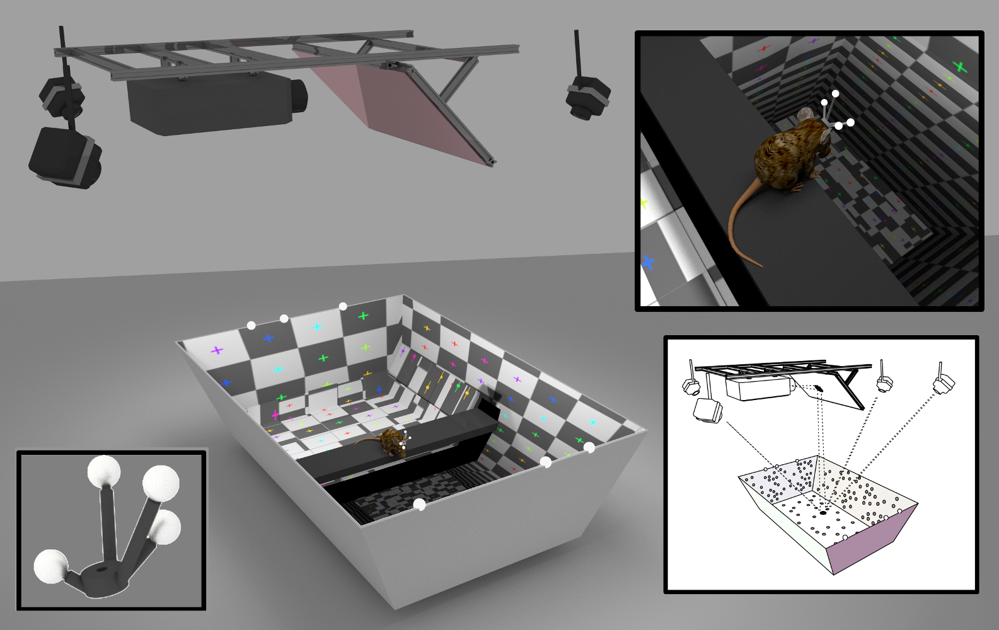

CAVE Virtual Reality
++++++++++++++++++++

Building your own virtual reality setup requires several parts:

  - A 3D Graphics Engine (to render the virtual environment)
  - Video Displays (to show the environment to the user).  Ideally, these should be large enough to allow the user to see a large amount of the virtual environment!  This means you'll either want something that is:
    - Head-fixed (the display is attached ot the user's head, so that they can always see a virtual space, no matter where they turn)
    - Projected on surfaces all around the user.  If there are screens in a 360-degree arc around the user, you get a CAVE system!
  - A head tracking system, to update the virtual environment when the user moves their head.  This is one of the things that gives such a strong immersive sense to virtual reality.

Our Setup
---------

The VR setup we made is intended for use by rats, mice, and gerbils for cognitive neuroscience experiments, which is why we call this python package ratcave!
In selecting our components, we were both limited by and helped by the small sizes of our users:

  - We use a simplified 3D graphics engine, to make our experiment scripts small and simple to deploy (python, with pyglet or psychopy + ratcave)
  - Head-mounting a display on mice wasn't an option because of their small size, so we use a single wide-lens video projector, which front-projects onto the walls and floor of the rodent's arena.  This gives them a 360-degree view of the virtual environment, while reducing the computational demands of our setup.
  - We use an optical tracking system for measuring the rodent's head space via data collected from camera arrays.  We use _NaturalPoint's Optitrack System: http://www.optitrack.com/
    - To control this tracking system from Python, we wrote a Python package called MotivePy, available here: https://github.com/neuroneuro15/motivepy
    - To access the data from the tracking system on a remote client in our experiment scripts, we wrote another Python client called NatNetClient, available here: https://github.com/neuroneuro15/natnetclient

Example VR Experiment Script
----------------------------

Writing a VR Script is relatively straightforward, and involves three main components:

  1) Connect to your tracking system
  2) Render your 3D environment
  3) In a loop, re-render the 3D environment, setting the camera position at the new eye position of your user.

In Pyglet, ratcave, and NatNetClient, this would something like this::

    import pyglet
    import ratcave as rc
    import natnetclient

    # Connect to Tracking System
    client = natnetclient.NatClient(ip='197.0.0.10', port=5023)
    user = client.rigid_bodies['User']

    # Create Scene and put in a draw loop
    window = pyglet.window.Window()
    reader = rc.WavefrontReader(rc.resources.obj_primitives)
    scene = rc.scene(meshes=[reader.get_mesh('Sphere', position=(0, 1, -2))

    @window.event()
    def on_draw():
        scene.draw()

    # Update camera position, based on user's position
    def update(dt):
        scene.camera.position = user.position
    pyglet.clock.schedule()

    # Start App
    pyglet.app.run()

In Psychopy, which is written in a more imperative format, it looks like this::

    from psychopy import visual, event
    import ratcave as rc
    import natnetclient

    # Connect to Tracking System
    client = natnetclient.NatClient(ip='197.0.0.10', port=5023)
    user = client.rigid_bodies['User']

    window = visual.Window()

    # Main Loop
    while 'escape' not in event.getKeys():

        # Create Scene
        reader = rc.WavefrontReader(rc.resources.obj_primitives)
        scene = rc.scene(meshes=[reader.get_mesh('Sphere', position=(0, 1, -2))

        # Update Camera position, based on user's position
        scene.camera.position = user.position

        # Draw
        scene.draw()
        window.flip()

Modular Nature of VR
--------------------

At it's core, VR does not stand for any one technology.  Whether you are using head-mounted screens or projector, optical camera array tracking systems or treadmills,
or any sort of graphics engine out there, the key is that you are changing the camera position on a loop, based on some user movement.  Hopefully, this description has given you
some ideas for how you can set up the your own VR system!